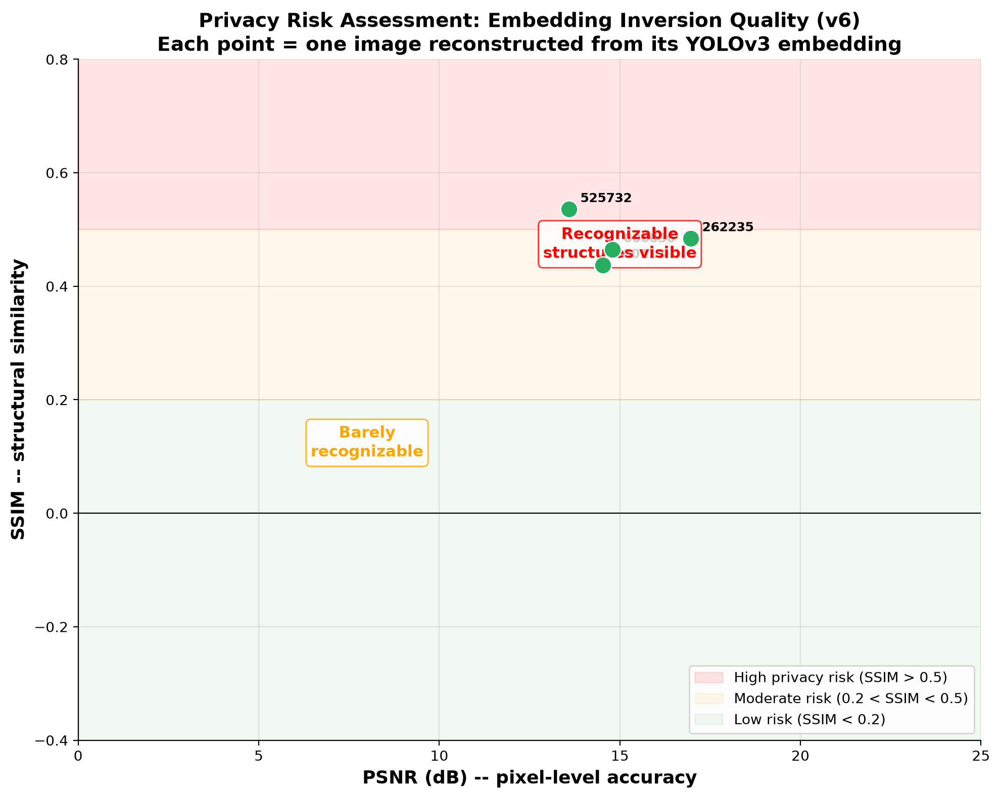
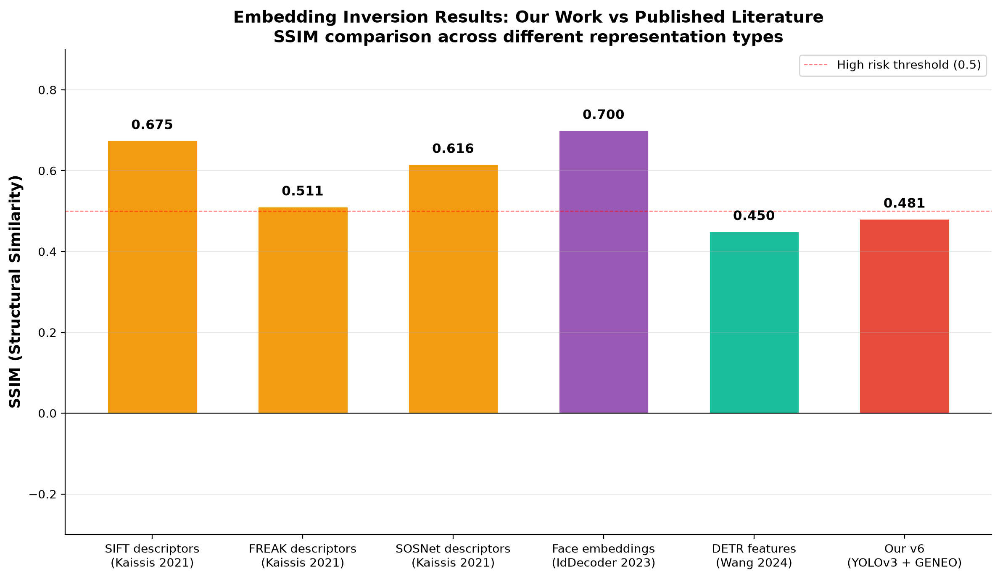

<div align="center">

# YOLOv3 Embedding Inversion

### Can you reconstruct an image from object detection output?


**Yes.** YOLOv3's detection embedding -- 904,995 numbers with **zero color or pixel data** -- can be inverted to recover recognizable images.

| Metric | Value | Meaning |
| -------- | ------- | --------- |
| **SSIM** | 0.481 | Structural similarity (1.0 = perfect) |
| **PSNR** | 15.0 dB | Pixel-level accuracy (higher = better) |
| **Similarity** | 74.0% | Human-friendly perceptual match |
| **Embedding size** | 904,995 values | 3 anchors x (5 box + 80 class) per grid cell |
| **Image size** | 519,168 values | 416 x 416 x 3 RGB |

</div>

---

## The Problem

<div align="center">

**Detection outputs are assumed to be anonymous. They are not.**

</div>

When you run YOLOv3 on an image, it outputs three grids of detection features:

```
head13:  255 x 13 x 13  =   43,095 values  (large objects)
head26:  255 x 26 x 26  =  172,380 values  (medium objects)
head52:  255 x 52 x 52  =  689,520 values  (small objects)
                                   --------
                                   904,995 values total
```

Each cell has **255 numbers** = `3 anchors x (5 box params + 80 COCO classes)`. These encode:

- **Objectness**: "is something here?"
- **Box geometry**: x, y, width, height
- **Class probabilities**: person, car, dog, etc.

**No color. No texture. No pixels.** Just "what objects are where."

Yet a trained decoder can reconstruct a recognizable image from this alone.

---

## The Evidence

<div align="center">

### Original vs Reconstruction


*Each pair: left = original image, right = reconstruction from YOLOv3 detection features only.*

</div>

---

## How It Works

<div align="center">

```
Original Image                    Frozen YOLOv3                    Trained Decoder
   416x416 RGB    --->    Detection Embedding    --->    Reconstructed Image
  519,168 pixels         904,995 features              416x416 RGB
                         (no color data)
```

</div>

The decoder has **7,316,387 parameters** and combines three architectural innovations:

### 1. GENEO Layers

Group Equivariant Non-Expansive Operators that respect C4 rotation symmetry. These provide geometric structure priors -- the decoder "knows" that rotating an object shouldn't change its fundamental layout.

### 2. Transformer Bottleneck

A 4-layer transformer encoder processes 169 spatial tokens (the 13x13 grid), establishing global relationships between distant grid locations before image upsampling.

### 3. Progressive Upsampling

U-Net-like decoder with lateral connections from the embedding:

```
256 x 13x13 -> 160 x 26x26 -> 112 x 52x52 -> 80 x 104x104 -> 48 x 208x208 -> 32 x 416x416 -> 3 x 416x416 RGB
```

Output is in YCbCr color space, then converted to RGB. The decoder learns to hallucinate plausible colors from training data statistics.

---

## Decoder Details

<div align="center">

| Image | SSIM | PSNR | Similarity |
| ------- | ------ | ------ | ------------ |
| 000000000036 | 0.465 | 14.8 dB | 73.3% |
| 000000000113 | 0.438 | 14.5 dB | 71.9% |
| 000000262235 | 0.485 | 17.0 dB | 74.2% |
| 000000525732 | 0.536 | 13.6 dB | 76.8% |
| **Average** | **0.481** | **15.0 dB** | **74.0%** |

</div>

The decoder (v6) was trained for **100 epochs** on **908 COCO images** with all 3 GENEO layers active (head13, head26, head52). Validation loss: **0.3415**.

### v6 vs earlier checkpoints

The architecture has 3 GENEO layers (one per detection head). Earlier checkpoint v3 only trained 1 GENEO layer (`geneo` on head13) for 37 epochs. When loaded into the current 3-GENEO architecture, 2 of 3 layers are randomly initialized, producing poor reconstructions:

| Checkpoint | GENEO layers trained | Epochs | SSIM | PSNR |
| ---------- | -------------------- | ------ | ------ | ------ |
| v3 on 3-GENEO arch | 1 of 3 (2 random) | 37 | 0.394 | 10.6 dB |
| **v6 on 3-GENEO arch** | **3 of 3 (all trained)** | **100** | **0.465** | **14.8 dB** |
| **Improvement** | | | **+0.071** | **+4.2 dB** |

The +4.2 dB PSNR jump is the difference between a blurry mess and a recognizable reconstruction.

---

## Privacy Risk

<div align="center">



</div>

Our results fall in the **moderate privacy risk** zone. SSIM above 0.2 means recognizable structure is recoverable. An attacker with:

1. Access to detection outputs (the embedding)
2. A trained decoder (this repo)

...can reconstruct approximate visual content of the original image.

**The embedding is 174% the size of the raw image** (904,995 vs 519,168 values). The privacy risk comes from the *structure* of the representation, not its size.

---

## Comparison With Literature

<div align="center">



</div>

This project was built **independently** before discovering the existing literature. Similar attacks exist across domains:

| Paper | Domain | Key Result |
| ------- | -------- | ------------ |
| Song & Raghunathan (2020) | Text embeddings | Recovered 50-70% of tokens |
| Morris et al. (2023) | Text embeddings | Recovered 92% of 32-token text |
| Mai et al. IdDecoder (2023) | Face embeddings | Reconstructed realistic faces |
| Kaissis et al. (2021) | Feature descriptors | RGB from SIFT/FREAK (SSIM 0.51-0.68) |
| Dosovitskiy & Brox (2016) | Visual features | Inverted DNN representations |
| Wang et al. (2024) | Detection transformers | Inverted DETR features |
| FIA-Flow (2025) | Multi-architecture | Black-box inversion with flow matching |

**Our contribution**: specific application to YOLOv3 with GENEO geometric operators. Modern approaches (diffusion priors, FIA-Flow) would likely achieve higher fidelity with less custom architecture.

---

## Run It Yourself

### Prerequisites: Download model files

The YOLOv3 Darknet weights (248 MB) and trained decoder checkpoint (87 MB) are excluded from git via `.gitignore`.

**YOLOv3 weights** -- download from the original Darknet source:

```powershell
cd model
python download_original_yolov3.py
```

This fetches `yolov3.weights` and `yolov3.cfg` from `pjreddie.com` (Joseph Redmon's original Darknet repo).

**v6 decoder checkpoint** -- this is a custom-trained checkpoint, not publicly hosted. If you trained it locally:

```powershell
Copy-Item ..\..\runs\geneo_ycbcr_v6\best.pt runs\geneo_ycbcr_v6_best.pt
```

Without these two files, embedding extraction and reconstruction will not run. All other files (code, embeddings, images, plots) are included in the repo.

### Setup

```powershell
cd model
pip install -r requirements.txt
```

### Extract an embedding from any image

```powershell
python extract_embedding.py --image images\000000000036.jpg --output embedding.npz
```

### Reconstruct the image

```powershell
python reconstruct_embedding.py --embedding embedding.npz --checkpoint runs\geneo_ycbcr_v6_best.pt --output reconstruction.png
```

### Or use a pre-extracted embedding

```powershell
python reconstruct_embedding.py --embedding embeddings\test_emb_000000000036.npz --checkpoint runs\geneo_ycbcr_v6_best.pt --output recon.png
```

### Regenerate plots

```powershell
cd ..\scripts
python make_presentation.py
python make_plots.py
```

---

## Folder Structure

```
presentation/
├── README.md                   You are here
├── comparison.png              Main figure (4 rows: original | reconstruction)
├── explanation.png             Research infographic with citations
├── side_by_side_*.png          Individual comparison pairs
├── metrics.csv                 Reconstruction metrics
├── model/                      Complete runnable pipeline
│   ├── inverse_decoder.py      Decoder (GENEO + transformer + upsampler)
│   ├── geneo_layer.py          GENEO operator implementation
│   ├── darknet_v3.py           Original Darknet YOLOv3 loader
│   ├── extract_embedding.py    Image -> embedding
│   ├── reconstruct_embedding.py  Embedding -> image
│   ├── yolov3.weights          Original Darknet weights (248 MB)
│   ├── yolov3.cfg              Original Darknet config
│   ├── runs/geneo_ycbcr_v6_best.pt  Trained decoder v6 (87 MB)
│   ├── images/                 4 sample COCO images
│   ├── embeddings/             4 pre-extracted .npz files
│   └── requirements.txt
├── plots/                      Publication-quality figures
│   ├── ssim_by_version.png         Per-image SSIM bars
│   ├── psnr_by_version.png         Per-image PSNR bars
│   ├── privacy_risk.png            Scatter with risk zones
│   ├── literature_comparison.png   Our results vs published work
│   ├── reconstruction_gallery.png  All 4 reconstructions side by side
│   ├── embedding_vs_image.png      Info capacity comparison
│   └── all_metrics.csv             All 4 measurements
└── scripts/                    Generation scripts
    ├── make_presentation.py       Main figures (comparison, explanation, side-by-side)
    ├── make_plots.py              Publication plots (SSIM, PSNR, privacy risk, gallery)
    ├── make_embedding_viz.py      Embedding dot-grid visualization
    ├── make_embedding_progression.py  3-panel embedding progression figure
    └── make_embedding_explained.py    2-panel concept + channel scatter figure
```

---

## Limitations

1. **Small test set** (4 images). Larger evaluation needed for statistical significance.
2. **COCO persons only**. Generalization to other classes/datasets is untested.
3. **Modern approaches exist**. Diffusion priors (FIA-Flow 2025) would achieve higher fidelity with less custom architecture.
4. **No defense tested**. Differential privacy, noise injection, or feature masking could reduce inversion quality.

---

## Citation

```bibtex
@misc{yolov3_inversion,
  title  = {YOLOv3 Embedding Inversion: Privacy Risk of Detection Features},
  author = {Carson},
  year   = {2025},
  note   = {Independent implementation. GENEO layers based on algebraic
            representation theorem for linear GENEOs.}
}
```

---

<div align="center">

**Detection features are not anonymous. The structure is the leak.**

</div>
